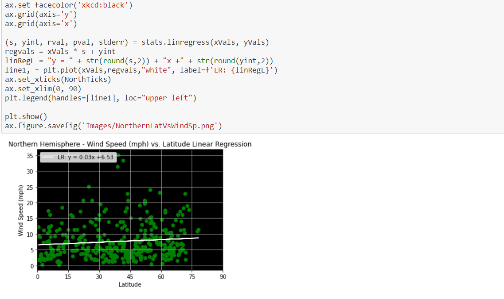
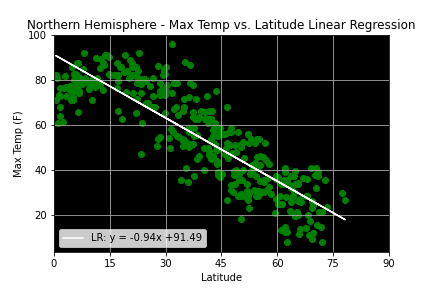
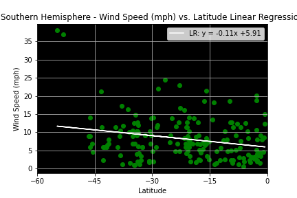
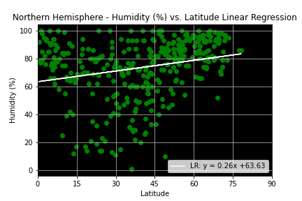

# leaflet-challenge
Using google heat maps and matplotlib plots to analyze data gathered from openweathermap api for a given day.

### Instructions
Ensure you have the modules used in the ipynb files installed in your environment. Then in your bash terminal, type "python WeatherPy.ipynb" or "python VacationPy.ipynb".

## Visuals:

### Vacation Visual Example:

### Vacation Visual Example:

